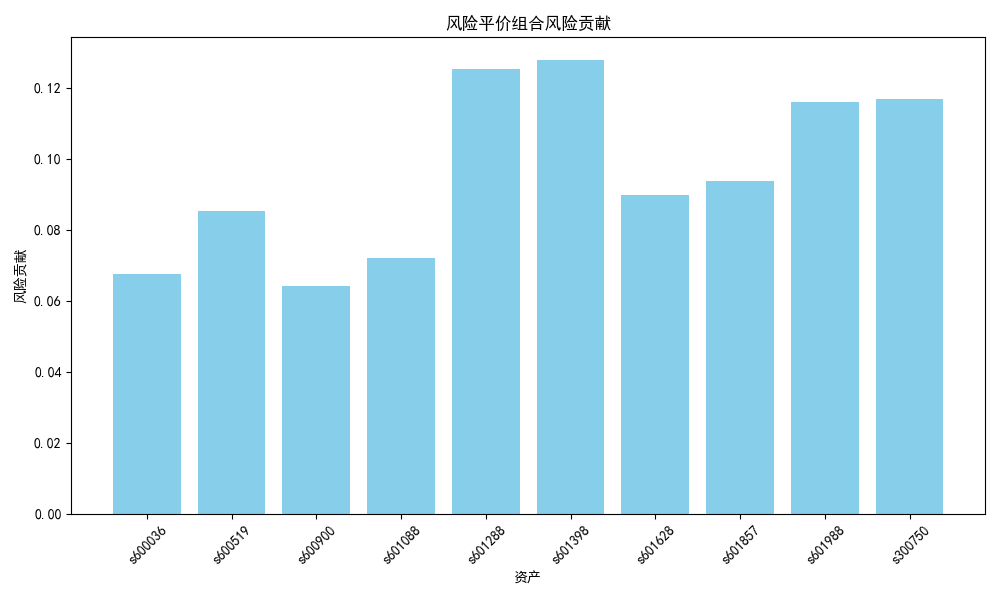
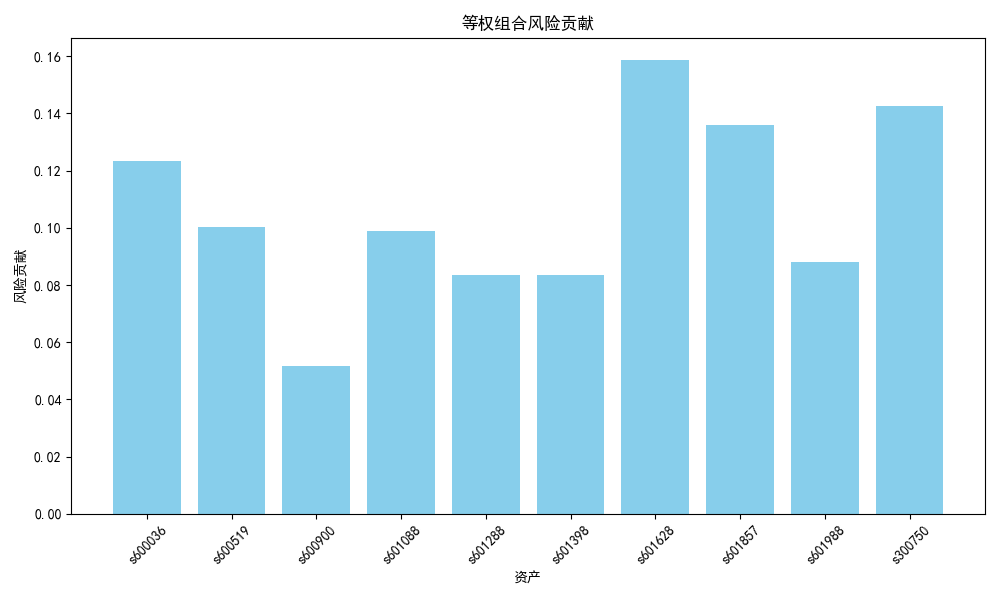
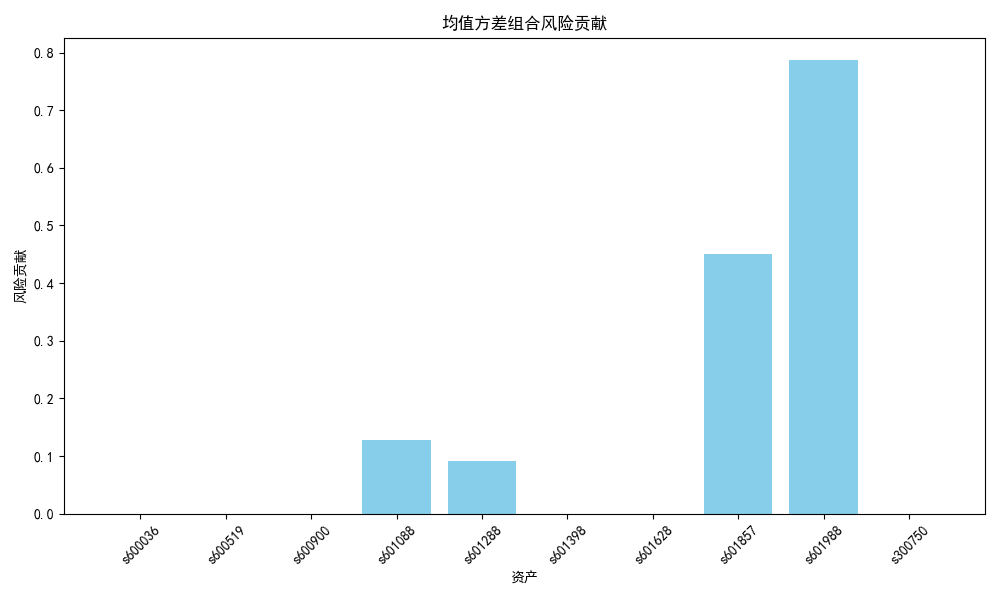

# 基于多资产数据的风险平价（Risk Parity）策略作业

## 1. 协方差矩阵

基于整个数据集计算的协方差矩阵如下（单位：%²）。

| 资产 | s600036 | s600519 | s600900 | s601088 | s601288 |
|------|---------|---------|---------|---------|---------|
| s600036 | 3.260 | 1.670 | 0.576 | 1.090 | 0.785 |
| s600519 | 1.670 | 2.782 | 0.373 | 0.483 | 0.172 |
| s600900 | 0.576 | 0.373 | 1.340 | 0.964 | 0.545 |
| s601088 | 1.090 | 0.483 | 0.964 | 3.444 | 0.801 |
| s601288 | 0.785 | 0.172 | 0.545 | 0.801 | 1.245 |
| s601398 | 0.849 | 0.257 | 0.545 | 0.801 | 1.016 |
| s601628 | 2.381 | 1.599 | 0.578 | 0.797 | 0.731 |
| s601857 | 1.370 | 0.436 | 0.887 | 2.203 | 0.988 |
| s601988 | 0.869 | 0.241 | 0.548 | 0.900 | 1.123 |
| s300750 | 1.488 | 2.039 | -0.022 | -0.117 | -0.279 |

| 资产 | s601398 | s601628 | s601857 | s601988 | s300750 |
|------|---------|---------|---------|---------|---------|
| s600036 | 0.849 | 2.381 | 1.370 | 0.869 | 1.488 |
| s600519 | 0.257 | 1.599 | 0.436 | 0.241 | 2.039 |
| s600900 | 0.545 | 0.578 | 0.887 | 0.548 | -0.022 |
| s601088 | 0.801 | 0.797 | 2.203 | 0.900 | -0.117 |
| s601288 | 1.016 | 0.731 | 0.988 | 1.123 | -0.279 |
| s601398 | 1.100 | 0.754 | 0.910 | 1.046 | -0.176 |
| s601628 | 0.754 | 4.611 | 1.308 | 0.776 | 1.974 |
| s601857 | 0.910 | 1.308 | 4.042 | 1.023 | 0.087 |
| s601988 | 1.046 | 0.776 | 1.023 | 1.368 | -0.164 |
| s300750 | -0.176 | 1.974 | 0.087 | -0.164 | 7.339 |

注：协方差矩阵基于整个数据集。

## 2. 构建风险平价组合
### 2.1 每个资产的权重

基于训练集数据得到的风险平价组合权重如下：

| 资产 | 权重 |
|------|------|
| s600036 | 0.0607 |
| s600519 | 0.0965 |
| s600900 | 0.1185 |
| s601088 | 0.0756 |
| s601288 | 0.1408 |
| s601398 | 0.1449 |
| s601628 | 0.0656 |
| s601857 | 0.0747 |
| s601988 | 0.1255 |
| s300750 | 0.0972 |

### 2.2 各资产的边际风险贡献

各资产的边际风险贡献如下：

| 资产 | 风险贡献 |
|------|----------|
| s600036 | 0.0850 |
| s600519 | 0.0845 |
| s600900 | 0.0850 |
| s601088 | 0.0848 |
| s601288 | 0.0849 |
| s601398 | 0.0849 |
| s601628 | 0.0848 |
| s601857 | 0.0848 |
| s601988 | 0.0850 |
| s300750 | 0.0850 |

### 2.3 验证是否接近平价

最大相对误差：0.0047 < 5%，表明风险贡献基本平价。

## 3. 对比分析

### 3.1 年化波动率

基于训练集数据构建均值方差组合权重，使用测试集数据比较风险平价组合、等权组合和均值方差组合的年化波动率，结果如下：

| 组合 | 年化波动率 (%) |
|------|----------------|
| 风险平价 | 15.5359 |
| 等权 | 16.3897 |
| 均值方差 | 19.1530 |

### 3.2 夏普比率

测试集数据的风险平价组合、等权组合和均值方差组合的夏普比率如下：

| 组合 | 夏普比率 |
|------|----------|
| 风险平价 | 1.7175 |
| 等权 | 1.5477 |
| 均值方差 | 1.6275 |

### 3.3 风险贡献分布图

## 4.思考

### 4.1 若某资产波动率突然上升，该策略的再平衡会如何调整该资产权重？

考虑风险平价模型，某资产的波动率突然上升导致其风险上升，再平衡为了保证各资产之间的风险评价会降低该资产的权重。

### 4.2 若资产之间相关性显著增加，对风险平价策略的效果有何影响？

当所有资产高度正相关时，协方差矩阵趋近于单因子结构：

$$
\Sigma \approx \sigma^2 \cdot \mathbf{1}\mathbf{1}^\top,
$$

其中 $\sigma^2$ 是共同的方差。
因此，由于资产之间相关性的增加，风险无法通过组合进行分散，风险平价策略效果下降。

### 4.3 若引入杠杆（例如目标组合波动率设为 20%），应如何调整权重？

引入杠杆将放大所有资产的波动率，相当于在原始的权重被放大了杠杆同等倍数。目标组合波动率设为20%，现有风险平价测试集的波动率为15.54%，加$n$倍杠杆后，新的权重和为$w_{new}$，波动率为：
$$
15.54% * n * w_{new}.
$$

因此如果要求目标波动率为20%，加n倍杠杆，新的权重总和应该进行如下调整：
$$
w_{new} = 1.287 / n.
$$